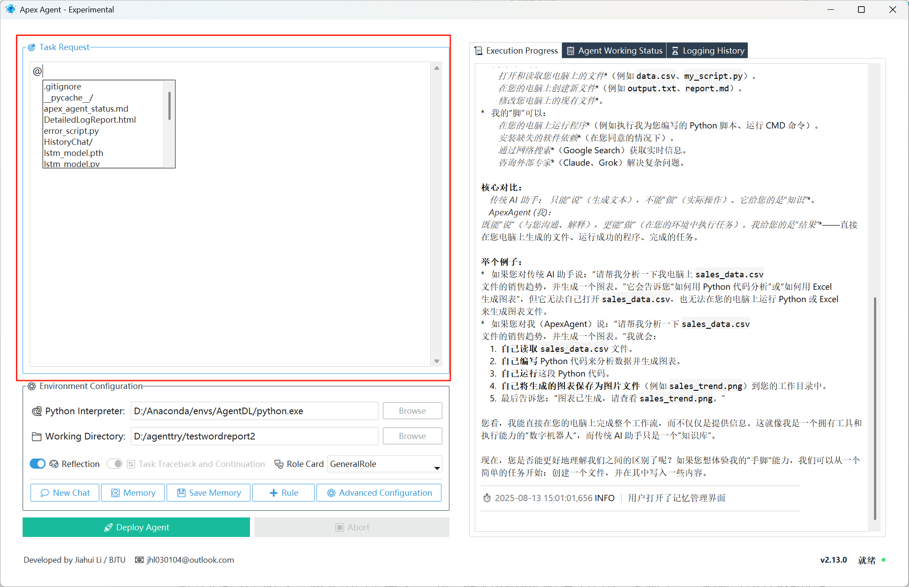
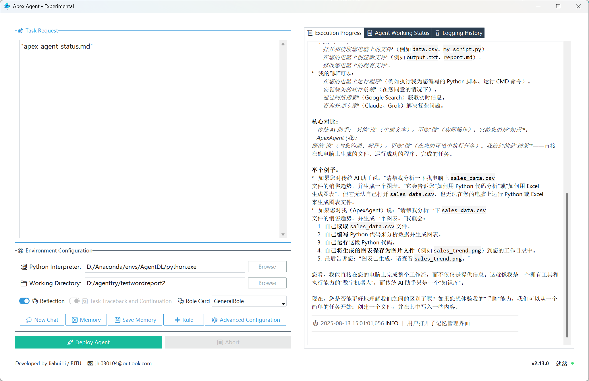
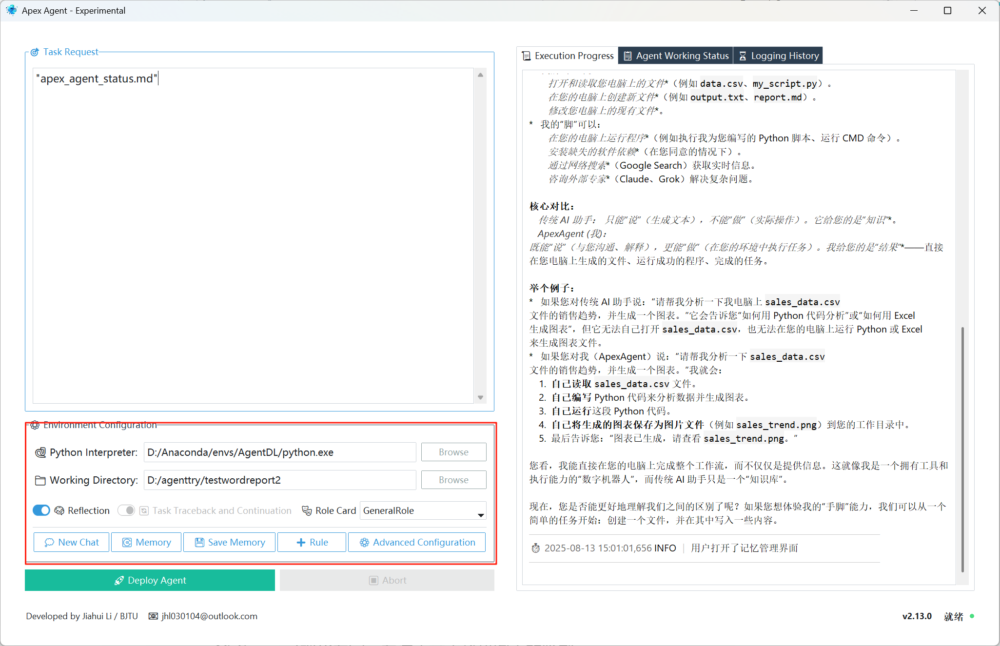
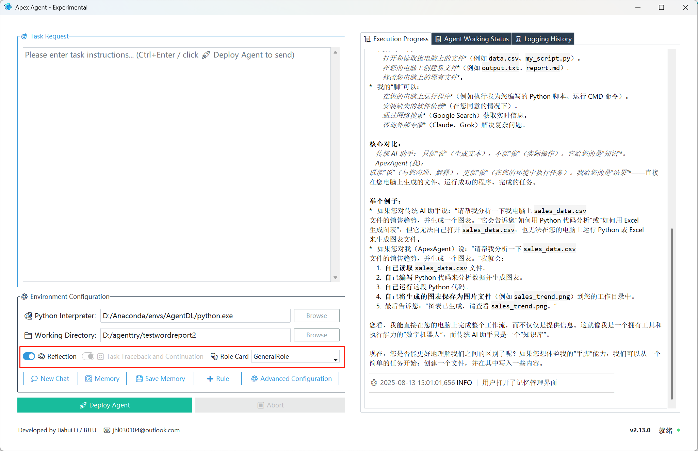
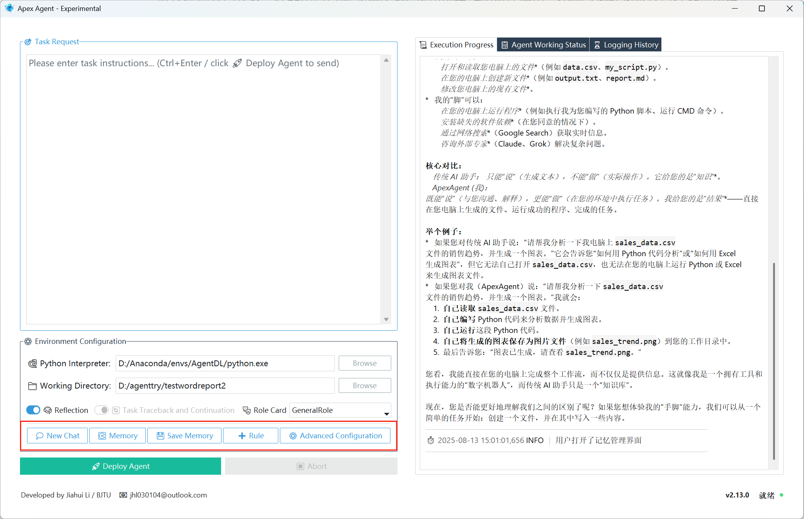
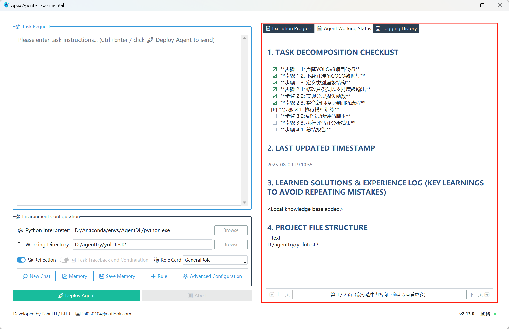

# 《Apex Agent 智能体用户手册》


**版本：V2.13.0**
**最后更新：2025年8月**

---

## **前言：欢迎来到智能体的新纪元**

尊敬的用户，您好！

欢迎您开启 Apex Agent 的探索之旅。我们深知，您或许习惯了与官网上的AI聊天助手进行问答互动，那种体验直接而便捷。然而，Apex Agent 将为您带来一种截然不同的、更为强大和深刻的人工智能协作模式。

**请忘掉“聊天”，拥抱“指挥”。**

传统的AI聊天助手是一个“信息咨询者”，您问，它答。**AI 聊天助手** 就像一个十分聪明的大脑，它拥有海量的知识，能够进行复杂的思考、分析和推理。您可以问它任何问题，它都能给出详尽的答案、建议，甚至能帮您构思文章、编写代码片段。但是，这个大脑没有“手”和“脚”*。*

- *它无法自己去打开您的电脑，无法在您的文件里查找信息，无法运行您电脑上的程序，也无法把生成的内容直接保存到您的硬盘上。*
- *它能告诉您“如何做”，但无法替您“实际去做”*。

而 **Apex Agent** 是一个“任务执行者”，一个拥有大脑、工具的数字化工作伙伴。您下达的是一个需要被完成的“项目”或“任务”，而不仅仅是一个需要被回答的“问题”。它会像一位执行者一样，进行思考、规划、行动、反思，并利用其“工具箱”与您的计算机环境进行交互，以达成最终目标。因此，它不仅拥有一个聪明的大脑（理解您的指令、规划任务、生成代码），还拥有“手”和“脚”（即能调用的各种工具）。

它可以做到：

- 打开和读取您电脑上的文件（例如 data.csv、my_script.py）。
- 在您的电脑上创建新文件（例如 output.txt、report.md）。
- 修改您电脑上的现有文件。
- 在您的电脑上运行程序（例如执行我为您编写的 Python 脚本、C/C++代码、运行 CMD 命令等）。
- 在您的环境中安装缺失的软件依赖（在您同意的情况下）。
- 通过网络搜索（Google Search）获取实时信息。
- 咨询外部AI 聊天助手（如Claude、Grok）解决复杂问题。
- ......

举个例子：

*   如果您对传统 AI 助手说：“请帮我分析一下我电脑上 sales_data.csv 文件的销售趋势，并生成一个图表。”它会告诉您“如何用 Python 代码分析”或“如何用 Excel 生成图表”，但它无法自己打开 sales_data.csv，也无法在您的电脑上运行 Python 或 Excel 来生成图表文件。
*   如果您对ApexAgent说：“请帮我分析一下 sales_data.csv 文件的销售趋势，并生成一个图表。”它就会：
    1.  自己读取 sales_data.csv 文件。
    2.  自己编写 Python 代码来分析数据并生成图表。
    3.  自己运行这段 Python 代码。
    4.  自己将生成的图表保存为图片文件（例如 sales_trend.png）到您的工作目录中。
    5.  最后告诉您：“图表已生成，请查看 sales_trend.png。”

现在，您是否能更好地理解我们之间的区别了呢？如果您想体验我的“手脚”能力，我们可以从一个简单的任务开始：创建一个文件，并在其中写入一些内容。

本手册旨在成为您驾驭 Apex Agent 的全方位指南。我们将从基础概念讲起，逐步深入到高级功能，通过详尽的解释和丰富的示例，帮助您：

*   **理解智能体的核心工作模式**：了解它如何思考和行动。
*   **掌握高效的指令技巧**：学会如何下达能被精确执行的任务。
*   **熟悉其强大的工具箱**：清楚它能做什么，不能做什么。
*   **精通其独特的记忆系统**：利用其长期记忆、检查点和回溯机制，处理复杂、长期的任务。
*   **配置您的专属Agent**：根据您的需求，定制化Agent的行为和环境。

请您耐心阅读。掌握了本手册中的知识，您将不仅仅是拥有了一个AI工具，更是拥有了一位能够7x24小时待命、不知疲倦、持续学习的智能工作伙伴。

现在，让我们一同进入 Apex Agent 的世界，开启智能协作的全新篇章。

---

## **目录**

[toc]

---

## **第一章：初识 Apex Agent——从“对话”到“任务”**

### **1.1. 什么是 Apex Agent？**

Apex Agent 是一款先进的智能体代理程序。它不仅仅是一个能与您对话的程序，更是一个能够理解复杂任务、制定计划、并利用一系列工具与您的计算机系统进行交互，最终完成指定目标的自动化工作伙伴。

您可以将它想象成一位虚拟的、高度智能的实习生。您交给他一个项目（例如，“请帮我分析这份CSV数据，并生成一份可视化报告”），他会自己去思考如何分解任务、需要用到哪些工具（比如编写和执行Python代码）、如何处理过程中遇到的错误，并最终向您交付成果。

### **1.2. 核心区别：Apex Agent vs. 传统AI聊天助手**

为了更好地使用 Apex Agent，理解它与我们熟知的网页AI聊天助手的根本区别至关重要。

|      特性      | 传统AI聊天助手 (如官网ChatGPT) |                    Apex Agent 智能体                     |
| :------------: | :----------------------------: | :------------------------------------------------------: |
|  **核心定位**  |         **问题回答者**         |                      **问题解决者**                      |
|  **交互模式**  |       一问一答，对话驱动       |                    任务驱动，项目导向                    |
|  **记忆能力**  |     短期、有限的上下文记忆     | **长期、结构化的记忆系统**，包括工作文档、经验库、检查点 |
| **与系统交互** |  无法与您的本地文件或程序交互  |    **可以通过“工具”** 读写文件、执行代码、运行命令行     |
|  **工作流程**  |    被动响应，等待下一个问题    |  **主动规划**，遵循“思考-行动-观察”的循环，自主推进任务  |
|  **错误处理**  | 可能会承认错误，但无法自行解决 |     **能够分析错误**，尝试修复，甚至通过反思机制学习     |
|  **用户角色**  |             提问者             |                   **指挥官、项目经理**                   |

**核心要点：** 您与 Apex Agent 的交互，更像是项目管理，而非简单的聊天。您设定目标，它负责执行。

### **1.3. Apex Agent 的工作循环：思考-行动-观察**

Apex Agent 的所有工作都遵循一个核心的闭环循环模式，这构成了它的“心跳”。

1.  **思考 (Thought)**：
    *   **目标审视**：Agent 首先会回顾您的初始任务和当前的总目标，确保自己没有偏离方向。
    *   **信息评估**：它会扫描完整的历史记录和工作状态文档，判断完成下一步所需的信息是否已经存在上下文。
    *   **行动决策**：基于当前状态和目标，它会决定下一步最合理、最高效的行动是什么。这个行动通常是调用一个具体的“工具”。

2.  **行动 (Action)**：
    *   Agent 会执行它在思考阶段决定的行动，例如：
        *   调用 `execute_python` 工具来运行一段代码。
        *   调用 `write_to_file` 工具来创建一个新的文件。
        *   调用 `google_search_func` 来查询一个技术问题。
    *   您会在“执行进度”日志中看到 Agent 决定采取的行动。

3.  **反馈(Feedback)**：
    *   行动执行后，系统会返回一个工具执行结果，并反馈“观察”给大脑LLM。
    *   观察结果可能是：
        *   代码执行成功后的输出。
        *   代码执行失败后的错误信息。
        *   文件读取后的内容。
        *   工具调用成功的确认信息。
    *   这个观察结果会作为新的信息，被添加到历史记录中，成为下一次“思考”循环的依据。

这个 **思考 -> 行动 -> 反馈** 的循环会不断重复，推进整个任务的执行。理解这个循环，是理解 Agent 如何“工作”的关键。

### **1.4. 您的新角色：从提问者到指挥官**

作为 Apex Agent 的用户，您的角色发生了根本性的转变。

*   **您是目标的设定者**：您需要清晰地定义任务的最终目标和成功标准。
*   **您是资源的提供者**：如果任务需要特定的文件、数据等信息，您需要提供给 Agent信息的访问路径（如本地的文件路径或网页数据的URL链接）。
*   **您是决策的审批者**：在关键节点或 Agent 遇到无法解决的困难时，它会通过 `consult_user_for_instruction` 工具向您请示，您需要适时做出决策协助它完成任务。
*   **您是过程的监督者**：通过观察日志和工作状态文档，您可以随时了解任务的进展，并在必要时进行干预。

放弃“一问一答”的习惯，开始像管理一个项目或指导一位员工那样与 Apex Agent 协作。您的指令越清晰，它的执行就越高效。

---

## **第二章：快速入门——您的第一个任务**

本章将带您完成与 Apex Agent 的第一次亲密接触，从熟悉界面到成功执行一个简单的任务。

### **2.1. 界面概览：认识您的指挥中心**

当您双击软件启动 Apex Agent 时，首先在电脑屏幕右上角上显示 Apex Agent 的 LOGO 图标挂件。双击该图标可展开系统主界面，界面分为左右两部分；再次双击则可收起主界面，避免遮挡屏幕，呈现类似桌面挂件的效果。


**左侧面板：输入与控制区**

1. **任务请求 (Task Request)**：此区域为您的主要输入窗口，用于下达任务指令。支持文件路径快捷操作：当需选择项目中的文件时，在输入框内键入“@”，即可自动列出当前项目下的所有文件。选择完成后，所选文件路径将自动被双引号包裹，方便用户操作。

   

   

2. **环境配置 (Environment Configuration)**：这里配置 Agent 工作所需的基础环境，包括Python解释器路径和工作目录。工作目录用于限定 Agent 的操作范围，所有后续文件操作默认基于此目录（除非明确指定其他路径），从而实现隔离，防止未经授权的访问或修改。Python 解释器被单独配置的原因在于其“万能工具”的特性：当 Agent 遇到自身不具备的工具或能力时，可通过编写 Python 脚本动态创建临时工具，间接完成任务。

   

3. **高级选项与功能按钮**：

   

   * **反思模式 (Reflection)**：Agent 在每一步执行时，系统会根据其思考内容实时通过 RAG 检索历史操作经验，并赋予 Agent 反思与元认知能力。当 Agent 遇到持续性障碍时，可自主启用自我反思引擎，获取额外建议和策略，突破思维定势的限制。需要注意的是，启用此功能可能会略微增加网络开销、延迟和 API 成本。

   * **任务追溯与接续 (Task Traceback and Continuation)**：该模式由系统自动启用，用户无法手动设置，且默认保持开启状态。除非用户点击“New Chat”按钮创建新的对话历史，否则 Agent 将默认以任务接续模式运行，基于现有上下文继续执行任务。

   * **角色卡 (Role Card)**：为 Agent 选择一个预设的专家角色，使其在特定领域的表现更专业。系统内置提供了以下角色卡：

     - GeneralRole:默认角色，通用的WorkFlow，一般情况下使用该模式即可;
     - VisExpert:可视化专家，专注于学术科研图表的绘制;
     - SeniorDataAnalyst:数据分析师，有一套成熟数据分析师的Work Flow;
     - PaperResearcher:论文研究员，有着专门设计的论文阅读个总结Work Flow;
     - DeepDiveResearcher:深度调研员，基于Google搜索+闭环Work Flow;
     - CodeRefactoring:代码重构师，专注于已有代码的重构任务。(注意，ApexAgent对Python有着更好的支持，可以系统可以自动构建各个代码间的依赖关系图)
     - 自定义角色卡:支持用户自定义角色卡，设计专门的Work Flow，但是需要用户自行到软件被下载到的地址里面去修改RoleCard文件夹，在里面添加对应角色的.md文档即可。

   * **功能按钮**：包括新建对话、记忆管理、保存检查点、添加规则和高级配置等。

     

     - **新建对话记忆（New Chat）**：点击“New Chat”按钮将启动新的对话记忆，并覆盖当前对话历史（此操作不可逆）。建议操作前点击“Save Memory”按钮，为节点设置名称和描述（便于日后回溯时快速了解保存的记忆检查点内容），或通过自然语言指示 Agent 保存记忆检查点（推荐，因 Agent 能更准确地总结检查点的描述与状态）。保存当前记忆后再创建新的对话记忆。

     - **记忆检查点管理（Memory）**：点击“Memory”按钮可清晰查看当前项目中保存的记忆检查点信息，包括各检查点的名称、创建时间、描述内容以及可行性状态（表示该检查点当前是否仍可行：True 表示未遇持续阻塞，False 表示已阻塞）。如下图所示，其中“dialog history”为当前对话记忆，不可删除；其他记忆检查点可通过点击查看 LOGO 浏览详情，或选择删除（删除操作不仅会移除对话记忆，还会清除该检查点对应的项目文件 Git 备份，耗时较长。鉴于 Git 强大的版本管理能力和极低的内存占用，建议**谨慎删除**）。

       **注意**：使用此功能需用户自行安装 Git 工具，并在“Advanced Configuration”参数配置中填入 git.exe 的路径（可通过命令行输入 where git 查看路径）。配置完成后方可正常使用。

       

     - **保存记忆检查点（Save Memory）**：此功能用于保存当前项目记忆及项目文件的 Git 备份，便于后续回溯至该节点。点击“Save Memory”按钮后，需为该节点设置名称和描述，以便日后回溯时能清楚了解每个节点的介绍和状态。用户既可手动点击按钮保存，也可通过在任务请求栏输入自然语言描述，指示 Agent 自动保存。推荐采用后者，因 Agent 具备出色的总结与表达能力，能生成描述清晰、质量更高的记忆检查点。

       **注意**：使用此功能需用户自行安装 Git 工具，并在“Advanced Configuration”参数配置中填入 git.exe 的路径（可通过命令行输入 where git 查看路径）。配置完成后方可正常使用。

     - **添加临时规则（Rule）**：此功能用于在当前任务窗口中临时添加规则约束，例如要求代码注释使用中文、图表绘制注意事项等。理论上，规则可在任务执行期间实时添加、更新或删除，但建议在任务启动前预先设置，尽量避免执行过程中频繁更改。一方面，大语言模型（LLM）基于序列预测原理生成输出，若前期输出为英文，即使后期添加中文输出规则，也可能因模型惯性继续输出英文；另一方面，LLM 支持键值（KV）缓存优化，规则通常嵌入初始 System Prompt 中，若任务进行中频繁修改规则，会导致缓存失效，从而增加模型推理成本、降低推理效率。

     - **配置全局参数（Advanced Configuration）**：点击此选项可进行智能体全局参数的配置： LLM 的基本配置，包括：底层 LLM 的 API 密钥、第三方中转 API 密钥；基本工具配置（如编译 C/C++ 代码所需的 vcvarsall.bat 开发工具、Git 工具等）；以及 Agent 参数配置（如底层 LLM 的温度、TopP 等参数，通常不需要用户手动设置，采用开发者预设的通用默认配置即可）。一般情况下，全局参数配置仅需在首次使用软件时设置一次，后续无需重复配置。

       

     

4. **主控制按钮**：

   *   **🚀 启动智能体 (Deploy Agent)**：开始执行任务，用户也可以在输入完任务请求后，直接快捷键CTRL+ENTR即可一键启动。
   *   **⏹ 中止 (Abort)**：此功能用于向智能体发送中止请求，停止当前执行的任务。中止过程非强制性或立即生效，而是先结束智能体启动的子进程（如代码或命令执行），随后向智能体发送中止信号，确保其完成当前任务后再停止，避免强制中止文件操作或其他 I/O 操作对用户系统造成损害。

**右侧面板：输出与监控区**

1.  **执行进度 (Execution Progress)**：实时显示 Agent 的当前的思考过程、调用的工具以及简短的执行结果。这是您观察 Agent “正在做什么”的主要窗口。
2.  **Agent 工作状态 (Agent Working Status)**：展示 `apex_agent_status.md` 文件的内容。这是 Agent 的长期工作笔记，记录了任务计划、关键进展、学习到的经验和项目文件结构。
3.  **日志历史 (Logging History)**：记录了历史的操作日志（默认最长可展示2000行，可以调节参数配置里面的`histroy max lines`参数），供您追溯和分析。您也可以在项目下找到名为：“DetailedLogReport.html”网页文件，浏览器打开查看最完整、详细的操作日志。

**底部状态栏**：显示开发者信息、版本号和 Agent 的当前状态（就绪、运行中、错误）。

### **2.2. 环境配置：Agent 工作的基础**

如前所述，基础环境配置用于设置 Agent 工作所需的核心环境，包括 Python 解释器路径和工作目录。这两个参数因项目需求可能需实时动态调整，因此被单独列出。以下详细介绍这两个关键参数配置的注意事项。

1.  **🐍 Python 解释器 (Python Interpreter)**：
    *   **作用**：指定 Agent 在执行 Python 代码时使用的具体 Python 环境。且由于其“万能工具”的特性：当 Agent 遇到自身不具备的工具或能力时，可通过编写 Python 脚本动态创建临时工具，间接完成任务。
    *   **如何配置**：点击“Browse”按钮，选择您希望 Agent 使用的 `python.exe` 文件。强烈建议您为项目创建一个独立的虚拟环境（如 venv 或 Conda），并指向该环境中的解释器，以避免污染您的全局 Python 环境。
    *   **重要性**：Agent 安装的所有依赖包，都会被安装到这个指定的解释器环境中。

2.  **📁 工作目录 (Working Directory)**：
    *   **作用**：这是 Agent 执行所有文件操作（创建、读取、写入）和代码执行的根目录。所有生成的文件、图片、代码、报告等成果都会存放在这里。此外，它还用于限定 Agent 的操作范围，所有后续文件操作默认基于此目录（除非明确指定其他路径），从而实现隔离，防止未经授权的访问或修改。
    *   **如何配置**：点击“Browse”按钮，选择一个空文件夹或项目文件夹作为工作目录。
    *   **最佳实践**：为每个新任务创建一个专属的工作目录，以保持项目文件的整洁和隔离。

### **2.3. 下达第一个指令：编写一个“Hello, World!”程序**

让我们来完成一个经典的入门任务。

1. **配置环境**：确保您已经指定了有效的 Python 解释器和工作目录。

2. **输入指令**：在左侧的“任务请求”框中，输入以下指令：

   ```
   请帮我创建一个名为 hello.py 的 Python 文件。
   这个文件应该包含一行代码，用于在控制台打印出 "Hello, Apex Agent!"。
   创建文件后，请执行它，并告诉我执行结果。
   ```

3. **部署 Agent**：点击 **🚀 部署智能体** 按钮。

### **2.4. 观察执行过程：解读实时日志**

点击部署后，请将注意力转移到右侧的“执行进度”面板。您会看到日志开始滚动，这正是 Agent 在工作的实时体现。您可能会看到类似以下的流程：

*   **`🤖 正在思考下一步行动...`**
    *   Agent 正在分析您的指令。

*   **`🧠 思考：用户要求创建并执行一个Python文件。第一步是创建文件。我需要调用 create_file 工具。`**
    *   这是 Agent 的思考过程。

*   **`✍️ 向文件中写入内容`**
    *   Agent 决定调用 `write_to_file` (或 `create_file`) 工具。

*   **`[Observation]: Tool `write_to_file` invocation successful. File 'hello.py' written successfully.`**
    *   这是工具执行后的观察结果，告诉您文件已成功创建。

*   **`🤖 正在思考下一步行动...`**
    *   Agent 再次进入思考循环。

*   **`🧠 思考：文件已经创建，下一步是执行它。我需要调用 execute_python 工具。`**

*   **`▶️ 执行Python代码`**

*   **`[Observation]: Tool `execute_python` invocation successful. Python execution result: Exit Code: 0, Stdout: 'Hello, Apex Agent!', Stderr: ''`**
    *   代码执行成功！您可以在 `Stdout` (标准输出) 中看到预期的打印结果。

*   **`🤔 Agent请示用户，需要您的指示`**
    *   任务完成后，Agent 会向您报告并请求下一步指示。

### **2.5. 查看工作状态文档：Agent 的“工作笔记”**

在任务执行过程中或结束后，切换到“Agent 工作状态”标签页。您会看到一个结构化的 Markdown 文档。这是 Agent 维护的长期记忆，即使关闭并重新打开应用（并选择任务追溯），这些信息依然存在。

您会看到类似这样的内容：

```markdown
## 1. TASK DECOMPOSITION CHECKLIST

- [x] **步骤 1: 创建 hello.py 文件**
- [x] **步骤 2: 执行 hello.py 文件**
- [ ] **步骤 3: 向用户报告结果**

## 2. LAST UPDATED TIMESTAMP

2025-08-12 10:30:00

## 3. LEARNED SOLUTIONS & EXPERIENCE LOG

* (暂无条目)

## 4. PROJECT FILE STRUCTURE
​```text
- hello.py
```

恭喜您！您已经成功指挥 Apex Agent 完成了您的第一个任务。现在，您已经掌握了与 Agent 协作的基础，是时候学习如何更高效地下达指令了。

---

## **第三章：指令的艺术——如何与 Apex Agent 高效沟通**

向 Apex Agent 下达指令，不同于与聊天机器人对话。您的指令是项目启动书，是行动的蓝图。指令的质量直接决定了 Agent 执行任务的效率和准确性。

### **3.1. 指令的核心原则：清晰、具体、可执行**

1.  **清晰 (Clear)**：避免使用模糊、歧义的词语。Agent 没有人类的常识和“读心术”，它会严格按照字面意思理解您的指令。
    *   **坏指令**：`“处理一下这个数据。”` (如何处理？目标是什么？)
    *   **好指令**：`“读取 data.csv 文件，计算'sales'列的总和与平均值，并将结果打印出来。”`

2.  **具体 (Specific)**：提供所有必要的细节。包括文件名、函数名、期望的输出格式、需要遵循的特定规则等。
    *   **坏指令**：`“写个爬虫。”` (爬取哪个网站？什么数据？保存格式？)
    *   **好指令**：`“编写一个Python爬虫脚本，名为 scraper.py。使用 requests 和 BeautifulSoup 库，爬取网站 'https://example.com' 的所有新闻标题和链接，并将结果保存为 'news.json' 文件，格式为 [{"title": "...", "link": "..."}, ...]。`

3.  **可执行 (Actionable)**：您的指令应该导向一个或一系列可以通过 Agent 工具箱完成的具体动作。
    *   **坏指令**：`“你觉得这个设计怎么样？”` (Agent 无法“觉得”，它需要执行任务。)
    *   **好指令**：`“分析 'app_design.png' 这张图片，列出其中所有的UI组件名称和颜色代码。”` (这是一个可以通过 `recognize_image_content` 工具完成的任务。)

### **3.2. 优秀指令的构成要素**

一个高质量的指令通常包含以下部分：

*   **最终目标 (The Goal)**：明确说明任务的最终目的是什么。
    *   *示例*：`“最终目标是训练一个能识别手写数字的简单神经网络模型。”`
*   **输入资源 (Inputs)**：告知 Agent 需要使用哪些文件或数据。
    *   *示例1（本地文件）*：`“请使用工作目录下的 'train_data.csv' 和 'test_data.csv' 作为训练和测试数据。”`
    *   *示例2（网络资源）*：`“克隆YOLOv8项目代码，并下载coco数据集，克隆/下载到当前项目下（也可以直接通过网址URL，确保更可靠的克隆/下载）”`
*   **产出物要求 (Outputs)**：明确说明任务完成后需要生成哪些文件或结果。
    *   *示例*：`“任务完成后，需要生成两个文件：一个是训练好的模型 'model.pth'，另一个是包含评估结果的 'report.txt'。”`
*   **约束与规则 (Constraints & Rules)**：告知 Agent 需要遵守的任何特殊规则。
    *   *示例*：`“约束：必须使用 PyTorch 框架，代码中不能使用 pandas 库，所有打印输出必须为中文。”`

### **3.3. “坏”指令的陷阱与规避**

|       陷阱类型       |           坏指令示例           |                         为什么不好？                         |                           如何改进                           |
| :------------------: | :----------------------------: | :----------------------------------------------------------: | :----------------------------------------------------------: |
|     **模糊不清**     |     `“帮我分析一下代码。”`     | Agent 不知道要分析什么（性能、bug、风格？），也不知道分析后做什么。 | `“请审查 'main.py' 文件的代码，找出其中可能存在的性能瓶颈，并将你的分析写在 'review.txt' 文件中。”` |
|     **依赖常识**     |    `“像上次那样处理就行。”`    | Agent 没有“上次”的记忆，它的记忆存储在结构化的历史记录和文档中，而非人类的模糊记忆。 | `“请按照我们在历史记录中确定的数据清洗流程（步骤A、B、C）来处理 'new_data.csv'。”` |
| **指令中含糊的引用** | `“把那个文件里的数据可视化。”` |            “那个文件”是哪个文件？Agent 无法猜测。            | `“请读取 'sales_data_q3.csv' 文件，并使用 matplotlib或seaborn 库创建一个折线图，展示‘月份’和‘销售额’两列的关系。”` |
|                      |                                |                                                              |                                                              |

### **3.4. 任务分解：将复杂目标拆解为步骤**

当面对一个宏大而复杂的任务时（例如，“开发一个完整的电商网站”），不要期望一次性下达所有指令。最佳实践是先做规划和任务拆解再执行。您可以参考下面的操作：

1.  **初始指令设定高层目标**：`“我们的目标是开发一个电商网站。第一阶段，我们先完成用户注册和登录功能。请为这个阶段制定一个详细的计划。”`
2.  **让 Agent 制定计划**：Agent 会向您提交一份详细的计划（Task Decomposition Checklist）。
3.  **与 Agent 确认计划**：您可以通过与Agent多轮对话，对计划进行修改、确认，直至获得您满意的执行方案。
4.  **分阶段执行**：一旦计划确认，即可让Agent 按照计划，一步步地执行。

### **3.5. 提供上下文：让 Agent 更“懂”你**

您可以通过 `@` 符号便捷的在任务指令中引用工作目录下的文件，为Agent提供上下文。当需选择项目中的文件时，在输入框内键入“@”，界面会自动弹出文件和目录的建议列表，方便您快速选择。选择完成后，所选文件路径将自动被""双引号包裹，方便用户操作。


### **3.6. Plan-Consult-Document-Execute：Agent 的强制工作流**

为了确保复杂任务的成功率和可控性，Apex Agent 被设计为严格遵循一个四步工作流：

1.  **计划 (Plan)**：接收到您的初始任务后，Agent 内部会首先制定一个详细的行动计划。
2.  **咨询 (Consult)**：Agent 先将计划呈现给您，并请求您的批准。**这是强制步骤**，确保您和 Agent 对任务的理解达成一致。如果您不满意，可直接反馈，告知你的想法和建议。
3.  **记录 (Document)**：在最终确定好方案并获得您的批准计划后，Agent 的第一个动作是更新工作状态文档，将确认后的计划写入工作状态文档，这是长期记忆的关键。
4.  **执行 (Execute)**：Agent严格按照记录在案的计划，开始执行任务循环。

理解并配合这个工作流，将使您与 Agent 的协作变得极为顺畅和高效。

### **3.7. 优秀指令案例集合（**必读**）**

为帮助您编写更高质量的任务指令，我们整理了一些经过Agent实测验证的优秀指令案例。

~~~markdown
## 案例 1：手写数字数据集聚类（传统机器学习基础）

### 数据集
- **来源**：sklearn.datasets.load_digits
- **规模**：1797 个样本，64 个特征（8x8 像素图像）
- **类别**：10 个类别（数字 0-9）

### 任务要求
1. 加载数据集并进行 PCA 降维（降至 2 维）。
2. 使用 K-means 算法进行聚类（k=10）。
3. 计算轮廓系数（Silhouette Score）评估聚类效果。
4. 可视化降维后的数据点及聚类中心。
5. 使用调整兰德指数（Adjusted Rand Index）对比聚类结果与真实标签。

### 评估指标
- 轮廓系数：评估聚类紧密度与分离度。
- 调整兰德指数：衡量聚类结果与真实标签的相似度。

### 注意事项
- 确保 PCA 降维保留主要信息。
- 可视化需清晰展示数据分布及聚类效果。
~~~

~~~markdown
## 案例 2：葡萄酒数据集模型优化（传统机器学习+优化）

### 数据集
- **来源**：sklearn.datasets.load_wine
- **规模**：178 个样本，13 个特征（酒精含量、苹果酸等）
- **类别**：3 个类别

### 任务要求
1. 加载数据集并进行标准化处理。
2. 使用 SVM 模型，通过网格搜索优化以下超参数：
   - C：[0.1, 1, 10, 100]
   - gamma：[1, 0.1, 0.01, 0.001]
   - kernel：['rbf', 'linear']
3. 输出最佳参数组合及对应的交叉验证分数。
4. 使用最佳模型在测试集上评估性能（准确率）。

### 评估指标
- 交叉验证分数（准确率）。
- 测试集准确率。

### 注意事项
- 确保数据标准化以提高模型性能。
- 网格搜索需合理设置交叉验证折数（如 5 折）。
~~~

~~~markdown
## 案例 3：地铁客流量 LSTM 时间序列预测（序列数据深度学习）

### 数据集
- **来源**：D:\agenttry\LSTM_test\北京地铁客流量数据.xlsx（“客运量”列）
- **格式**：时间序列数据

### 任务要求
1. 使用 PyTorch 创建并封装 LSTM 模型类。
2. 读取数据，划分训练集和测试集。
3. 训练 LSTM 模型，并根据评估结果判断性能。
4. 若性能不佳，调整参数、模型结构或更换更复杂模型（如 GRU）。
5. 可视化最佳模型的预测结果并保存至当前项目下。
6. 保存训练好的模型至当前项目下。
7. 创建脚本加载模型，生成相似测试数据进行预测，并可视化结果，保存至当前项目下。

### 评估指标
- 预测误差（MAE、RMSE）。
- 可视化结果的清晰度与准确性。

### 注意事项
- 数据预处理需考虑时间序列特性（如滑动窗口）。
- 模型优化需记录调整过程及依据。
- 使用 GPU（RTX4090）加速训练。
~~~

~~~markdown
## 案例 4：MNIST 手写数字分类（图像数据深度学习基础）

### 数据集
- **来源**：torchvision.datasets.MNIST
- **规模**：60,000 张训练图像，10,000 张测试图像（28x28 灰度图像）
- **类别**：10 个类别（0-9）

### 任务要求
1. 加载数据集并解压至当前项目下，进行预处理（归一化等）。
2. 构建 CNN 模型，至少包含 2 个卷积层和 2 个全连接层。
3. 使用 Adam 优化器和交叉熵损失进行训练。
4. 在测试集上评估准确率和混淆矩阵。
5. 若性能不佳，优化参数或模型结构。
6. 保存最佳模型至当前项目下。
7. 可视化混淆矩阵，保存至当前项目下。
8. 编写技术报告，记录实验过程和结果。

### 评估指标
- 测试集准确率。
- 混淆矩阵的清晰度与准确性。

### 注意事项
- 确保 CNN 结构合理，卷积核大小、池化层等需适配 MNIST 数据。
- 优化过程需记录调整细节。
~~~

~~~markdown
## 案例 5：多变量时间序列预测（LSTM 进阶）

### 数据集
- **来源**：当前项目下的.\household_power_consumption.txt
- **规模**：多变量时间序列（全局有功功率、电压等 7 个变量）
- **格式**：2 分钟间隔采样

### 任务要求
1. 使用滑动窗口（窗口大小=60，预测步长=12）构建训练样本。
2. 构建双向 LSTM 模型，加入注意力机制。
3. 实现自定义损失函数（考虑预测误差和趋势）。
4. 对比单变量 LSTM、多变量 LSTM 和带注意力机制的双向 LSTM 性能。
5. 可视化预测结果和误差分布。
6. 保存结果至当前项目下。

### 评估指标
- 多步预测的 MAE、RMSE。
- 预测趋势准确率（>75%）。
- 推理时间。

### 注意事项
- 使用 GPU（RTX4090）加速训练。
- 确保注意力机制实现正确，提升模型对关键时间点的关注。
- 自定义损失函数需平衡误差和趋势预测。
~~~

~~~markdown
## 案例 6：CIFAR-100 复杂图像分类（CNN 进阶）

### 数据集
- **来源**：torchvision.datasets.CIFAR100
- **规模**：60,000 张 32x32 彩色图像
- **类别**：100 个细粒度类别

### 任务要求
1. 从零实现 ResNet50 架构。
2. 添加 CutMix 和 MixUp 数据增强策略。
3. 实现学习率热启动和余弦退火调度。
4. 使用标签平滑技术。
5. 对比 AdamW 和 SGD with momentum 优化器效果。
6. 使用 t-SNE 可视化特征空间变化。
7. 每 10 轮保存 checkpoint，确保准确率 >70%。

### 评估指标
- 测试集准确率（目标：>70%）。
- 特征空间可视化质量。
- 训练日志的完整性。

### 注意事项
- 使用 GPU（RTX4090）加速训练。
- 数据增强需适配 CIFAR-100 数据特性。
- 确保 ResNet50 实现正确，残差连接无误。
~~~

~~~markdown
## 案例 7：动漫人脸生成（GAN 进阶）

### 数据集
- **来源**：当前项目下的.\data\（21,551 张高质量动漫人脸 PNG 图像）

### 任务要求
1. 实现 Progressive GAN 架构。
2. 设计自适应数据增强策略。
3. 实现 Wasserstein 损失函数和梯度惩罚。
4. 监控模式崩溃问题。
5. 计算 FID 指标及隐空间插值可视化。
6. 每 10 轮保存 checkpoint。

### 评估指标
- FID 分数（目标：尽可能低）。
- 生成图像多样性（潜空间最近邻）。
- 生成图像质量（主观评估）。

### 注意事项
- 使用 GPU（RTX4090）加速训练，优化显存使用。
- Progressive GAN 需逐步增加分辨率，注意训练稳定性。
- FID 计算需确保 Inception 模型正确加载。
~~~

~~~markdown
## 案例 8：CartPole 强化学习（DQN 基础）

### 数据集/环境
- **来源**：OpenAI Gym CartPole-v1
- **状态空间**：4 维连续变量（小车位置、速度、杆角度、角速度）
- **动作空间**：2 个离散动作（向左/向右）

### 任务要求
1. 实现 DQN 算法（Q 网络含至少 2 个全连接层，经验回放容量 10,000，ε-贪心策略从 0.9 衰减到 0.05）。
2. 训练至少 500 个 episode，每 100 个 episode 记录平均奖励。
3. 测试 100 个 episode，平均奖励需 ≥195。
4. 若性能不佳，优化超参数或网络结构。
5. 可视化奖励曲线并保存。
6. 保存模型并创建测试脚本，录制 10 个 episode 视频，保存为 MP4。

### 评估指标
- 测试集平均奖励（目标：≥195）。
- 收敛速度。
- 视频演示稳定性。

### 注意事项
- 使用 GPU（RTX4070）加速训练。
- 确保经验回放和目标网络更新频率合理。
- 视频录制需清晰展示控制效果。
~~~

~~~markdown
## 案例 9：IMDB 情感分析（自然语言处理基础）

### 数据集
- **来源**：datasets.load_dataset("imdb")
- **规模**：25,000 条训练样本，25,000 条测试样本（文本评论，0=负面，1=正面）

### 任务要求
1. 使用 transformers 库的 BERT 分词器（最大序列长度 128）预处理数据。
2. 基于 BertForSequenceClassification（bert-base-uncased）构建模型。
3. 使用 AdamW 优化器（学习率 5e-5）和交叉熵损失训练 3 个 epoch。
4. 在测试集上计算准确率、F1 分数和混淆矩阵。
5. 若准确率 <85%，调整超参数或添加 Dropout 优化。
6. 可视化混淆矩阵并保存。
7. 编写技术报告。

### 评估指标
- 测试集准确率（目标：≥85%）。
- F1 分数。
- 训练和推理时间。

### 注意事项
- 使用 GPU（RTX4070）加速训练。
- 确保 BERT 分词器正确处理长文本。
- 技术报告需记录优化过程。
~~~

~~~markdown
## 案例 10：MNIST 手写数字生成（DCGAN 基础）

### 数据集
- **来源**：torchvision.datasets.MNIST
- **规模**：60,000 张 28x28 灰度图像，10 个类别

### 任务要求
1. 加载数据集，归一化到 [-1, 1]，批大小 128。
2. 构建 DCGAN 模型：
   - 生成器：3 个转置卷积层，从 100 维噪声生成图像。
   - 判别器：3 个卷积层，判断图像真伪。
3. 使用 Adam 优化器（学习率 2e-4，beta1=0.5）训练 50 个 epoch。
4. 每 10 个 epoch 保存生成图像（64 张）。
5. 计算 FID 分数，若 >50，优化模型。
6. 保存生成器模型，创建测试脚本生成 100 张图像。

### 评估指标
- FID 分数（目标：≤50）。
- 生成图像视觉质量。
- 训练稳定性（损失曲线）。

### 注意事项
- 使用 GPU（RTX4070）加速训练。
- 注意 GAN 训练稳定性，可尝试 Wasserstein 损失或标签平滑。
- 保存清晰的训练日志。
~~~

~~~markdown
## 案例 11：形色牌图像处理与成组识别（传统图像处理）

### 数据集
- **来源**：当前项目下的.\zhengli（IMG_X_card_Y.jpg，X=1-77，Y=1-12）
- **规模**：81 张卡牌图像，每张包含 4 种属性（数目、形状、颜色、填充），每种属性 3 种取值：
  - 数目：1, 2, 3
  - 形状：椭圆，菱形，波浪
  - 颜色：红色，绿色，蓝色
  - 填充：实心，阴影，空心

### 任务要求
1. **图像加载与预处理**：
   - 遍历并加载所有卡牌图像。
   - 转换为灰度图（用于轮廓检测）和 HSV 颜色空间（用于颜色识别）。
   - 应用高斯模糊去除噪声。
2. **符号分割与计数**：
   - 使用 Canny 边缘检测或二值化后查找轮廓（cv2.findContours）。
   - 根据面积、周长等筛选有效轮廓，统计数目（1, 2, 3）。
3. **属性分析**（对每个符号）：
   - **颜色**：在 HSV 空间定义红、绿、蓝阈值，统计像素分布确定颜色。
   - **形状**：使用 cv2.approxPolyDP 逼近轮廓，结合 Hu 矩或几何特征区分椭圆、菱形、波浪。
   - **填充**：分析轮廓内部像素比例，区分实心（>85%）、空心（<30%）、阴影（30%-70%）。
4. **属性存储**：
   - 存储每张卡牌的属性（数目、形状、颜色、填充）与文件名关联。
5. **成组判断**：
   - 遍历所有 3 张卡牌组合（itertools.combinations）。
   - 检查 4 种属性是否满足“全同”或“全不同”（数学技巧：属性值模 3 等于 0）。
6. **结果汇报**：
   - 输出所有满足“成组”条件的卡牌组合（文件名）。

### 评估指标
- 属性提取的准确率。
- 成组识别的完整性与正确性。
- 处理流程的鲁棒性（应对光照变化、形变等）。

### 注意事项
- 使用 OpenCV 库（cv2）实现。
- 阈值参数（如面积、颜色范围、填充比例）需根据实际图像调整。
- 波浪形状和阴影填充识别是主要难点，需设计鲁棒特征。
~~~

~~~markdown
## 案例 12：咖啡馆人员流量统计与实验报告（视频分析与报告撰写）

### 数据集与资源
- **视频**：当前项目下的.\video.mp4（6 分 21 秒，8 倍速，咖啡馆场景，偏暗光）
- **代码文件**：yolovdtest.py, yolovdtest2.py, yolovdtest3.py, yolovdtest4.py
- **数据文件**：guest_statistics.csv, guest_statistics_n.csv, guest_statistics2.csv, guest_statistics_n2.csv
- **视频结果**：video_with_counts.mp4, video_with_counts_n.mp4, video_with_counts2.mp4, video_with_counts_n2.mp4
- **配置文件**：botsort.yaml, bytetrack.yaml

### 任务要求
1. **代码分析**：
   - 分析 4 个版本代码的设计原理、实现细节及参数配置。
   - 梳理版本间差异，明确每次改进的原因与目标。
   - 阐述逻辑递进关系。
2. **数据分析与可视化**：
   - 分析 4 个统计数据文件，提取实时客人数与累计客人数。
   - 生成以下可视化图表：
     - 折线图：随时间变化的实时客人数（对比 4 个版本）。
     - 柱状图：每分钟（或 30 秒）平均客人数（对比 4 个版本）。
     - 额外图表：如累计客人数曲线或其他反映追踪稳定性的图表。
   - 保存图表至项目路径（PNG/JPG 格式）。
3. **HTML 实验报告**：
   - 结构：
     - **引言**：介绍项目目标。
     - **背景与问题描述**：阐述视频特点与挑战。
     - **实验方法**：概述 YOLO 检测、目标追踪及优化策略。
     - **代码实现与迭代**：详细分析 4 个版本代码的改进过程。
     - **结果与分析**：嵌入可视化图表及结果视频，分析性能差异。
     - **结论与展望**：总结发现，提出改进方向。
   - 保存报告为 HTML 文件，确保前端代码规范、兼容性良好。

### 评估指标
- 代码分析的深度与准确性。
- 可视化图表的清晰度与信息量。
- 报告内容的严谨性与学术风格。

### 注意事项
- 不执行代码，仅基于文件分析。
- 针对 8 倍速视频和偏暗场景，分析优化措施（如帧率处理、亮度调整、追踪参数）。
- 确保 HTML 报告嵌入的图片和视频路径正确。
~~~

~~~markdown
#### **案例 13 - 经典数据分析与特征工程 (泰坦尼克号生存预测)**

这个案例是数据科学入门的“Hello World”，但它麻雀虽小五脏俱全，非常适合测试Agent进行**探索性数据分析（EDA）、数据清洗、特征工程和基础模型构建**的端到端能力。

*   **测试能力:** 数据清洗、特征工程、处理缺失值、分类模型综合应用
*   **数据集:** Kaggle经典竞赛数据集 "Titanic - Machine Learning from Disaster"
    *   **数据位置:**当前项目下的./test11taitanit
    *   **数据描述:** 包含`train.csv`和`test.csv`两个文件。数据包括乘客的年龄、性别、船舱等级、票价、登船港口等信息，以及他们是否生还（目标变量）。数据中存在缺失值（如`Age`, `Cabin`）和需要转换的文本特征。
*   **依赖项:** `pandas`, `numpy`, `scikit-learn`, `matplotlib`, `seaborn`
*   **任务要求:**
    1.  **加载数据:** 使用`pandas`加载`train.csv`和`test.csv`。
    2.  **探索性数据分析(EDA):**
        *   计算并可视化各特征（如`Pclass`, `Sex`, `Embarked`）与生存率（`Survived`）的关系。
        *   可视化数值特征（如`Age`, `Fare`）的分布情况。
    3.  **数据清洗与预处理:**
        *   **处理缺失值:** 对`Age`列使用合理的方法进行填充（如均值、中位数或基于`Pclass`和`Sex`的均值填充）；对`Embarked`列的缺失值进行填充；`Cabin`列缺失值过多，可以考虑将其转换为一个新特征（如`Has_Cabin`）或直接舍弃。
        *   **处理`test.csv`中的`Fare`缺失值。**
    4.  **特征工程:**
        *   从`Name`列中提取乘客的称谓（如Mr, Mrs, Miss）作为一个新的特征`Title`。
        *   将`SibSp`（兄弟姐妹/配偶数）和`Parch`（父母/子女数）合并为`FamilySize`特征。
        *   将分类特征（如`Sex`, `Embarked`, `Title`）转换为数值特征（使用独热编码或标签编码）。
    5.  **模型训练与评估:**
        *   选择至少两种分类模型（如逻辑回归`LogisticRegression`和随机森林`RandomForestClassifier`）进行训练。
        *   使用交叉验证评估模型性能，并输出准确率（Accuracy）和F1分数。
    6.  **结果提交:**
        *   使用表现最好的模型对`test.csv`进行预测。
        *   生成一个符合Kaggle提交格式（参考`gender_submission.csv`文件）`submission.csv`文件，包含`PassengerId`和`Survived`两列。
~~~

~~~markdown
#### **案例 14 - 高级回归任务与特征工程 (房价预测)**

这是一个比泰坦尼克号更复杂的回归问题，拥有更多样化的特征（数值、类别、有序类别），对特征工程和模型选择的要求更高。

*   **测试能力:** 处理复杂数据集、高级特征工程、回归模型调优、特征重要性分析
*   **数据集:** Kaggle竞赛数据集 "House Prices - Advanced Regression Techniques"
    *   **数据位置:**D当前项目下的.\test12houseprice
    *   **数据描述:** 包含`train.csv`和`test.csv`。数据集有79个解释变量，描述了爱荷华州埃姆斯市房屋的方方面面，目标是预测最终的销售价格（`SalePrice`）。数据中包含大量缺失值和多种数据类型。
*   **依赖项:** `pandas`, `numpy`, `scikit-learn`, `matplotlib`, `seaborn`, `xgboost`, `lightgbm`
*   **任务要求:**
    1.  **加载数据:** 加载`train.csv`和`test.csv`。
    2.  **数据预处理:**
        *   分析目标变量`SalePrice`的分布，并对其进行对数变换（log-transform）以处理其右偏分布。
        *   识别并处理所有特征的缺失值，需要根据特征含义选择不同策略（如用0填充车库面积、用'None'填充地下室质量等）。
        *   将部分数值特征（如房屋建造年份）转换为类别特征（如房龄）。
    3.  **特征工程:**
        *   将有序类别特征（如`ExterQual`）映射为数值。
        *   对名义类别特征进行独热编码。
        *   合并一些相关特征，例如总浴室数量。
    4.  **模型训练与调优:**
        *   使用梯度提升模型（如`XGBoost`或`LightGBM`）进行训练，因为它们在此类问题上通常表现优异。
        *   使用网格搜索或随机搜索对模型的关键超参数进行调优。
    5.  **模型评估:**
        *   使用Kaggle竞赛的官方评估指标——**均方根对数误差（RMSLE）**来评估模型。
        *   可视化模型的特征重要性，找出影响房价的关键因素。
    6.  **结果提交:**
        *   对测试集进行预测（记得将预测结果逆对数变换），并生成符合文件格式规范（参考`sample_submission.csv`文件）的输出结果。
~~~

~~~markdown
#### **案例 15 - 推荐系统入门 (MovieLens电影推荐)**

推荐系统是数据分析的一个重要分支，此案例用于测试Agent构建一个基础协同过滤推荐系统的能力。

*   **测试能力:** 推荐系统基础、协同过滤、矩阵分解
*   **数据集:** MovieLens Small Dataset
    *   **数据位置:** 当前项目下的.\ml-latest
    *   **数据描述:** 包含`ratings.csv`（用户对电影的评分）、`movies.csv`（电影信息）等文件。
*   **依赖项:** `pandas`, `numpy`, `scikit-surprise`
*   **任务要求:**
    1.  **加载数据:** 使用`pandas`加载`ratings.csv`和`movies.csv`。
    2.  **数据准备:**
        *   使用`surprise`库的`Reader`和`Dataset`类来加载评分数据。
        *   将数据集划分为训练集和测试集。
    3.  **模型构建与训练:**
        *   构建一个基于矩阵分解的协同过滤模型，例如**SVD (Singular Value Decomposition)**。
        *   在训练集上训练该模型。
    4.  **模型评估:**
        *   在测试集上进行预测，并使用**RMSE (均方根误差)** 和 **MAE (平均绝对误差)** 评估模型性能。
    5.  **生成推荐:**
        *   为指定的用户（例如，用户ID为1）推荐5部他可能最喜欢但还未看过的电影。
        *   需要实现一个函数，输入用户ID，输出推荐的电影列表（包含电影标题）。
~~~

~~~markdown
#### **案例 16 - 不均衡数据处理与异常检测 (信用卡欺诈检测)**

这个案例专注于一个在金融、安全等领域非常常见的挑战：处理高度不均衡的数据集和进行异常检测。

*   **测试能力:** 处理高度不均衡数据、异常检测模型、采样技术、评估指标选择
*   **数据集:** Kaggle数据集 "Credit Card Fraud Detection"
    *   **数据位置** 当前项目下的.\creditcard.csv
    *   **数据描述:** 数据包含284,807笔交易，其中只有492笔是欺诈交易（占比0.172%）。特征`V1`到`V28`是PCA降维后的结果，以保护用户隐私。`Time`和`Amount`是原始特征。`Class`是目标变量（1为欺诈，0为正常）。
*   **依赖项:** `pandas`, `numpy`, `scikit-learn`, `matplotlib`, `seaborn`, `imblearn`
*   **任务要求:**
    1.  **加载数据:** 加载`creditcard.csv`。
    2.  **数据预处理:**
        *   对`Amount`和`Time`特征进行标准化（`StandardScaler`）。
    3.  **处理不均衡问题:**
        *   **方法一（不处理）:** 直接使用原始数据训练一个基准模型（如`LogisticRegression`）。
        *   **方法二（过采样）:** 使用`imblearn`库中的**SMOTE (Synthetic Minority Over-sampling Technique)**对训练数据进行过采样，以生成更多的少数类（欺诈）样本。
    4.  **模型训练:**
        *   在经过SMOTE处理后的数据上重新训练`LogisticRegression`模型。
        *   尝试使用一个专门用于异常检测的模型，如`IsolationForest`或`LocalOutlierFactor`。
    5.  **模型评估:**
        *   **重点:** 由于数据极度不均衡，**不能使用准确率**作为评估指标。
        *   计算并对比不同方法下的**精确率(Precision)、召回率(Recall)、F1分数**。
        *   绘制并对比**PR曲线 (Precision-Recall Curve)**，计算**AUPRC (Area Under the PR Curve)**。
        *   生成并可视化混淆矩阵，分析模型对欺诈交易的识别能力。
~~~

~~~markdown
#### **案例 17 - 地理空间数据分析与可视化 (纽约市出租车行程时间预测)**

此案例引入了地理空间数据，测试Agent处理坐标数据、进行相关特征工程以及使用专业库进行地理可视化的能力。

*   **测试能力:** 处理地理空间数据、特征工程（距离计算）、交互式地图可视化
*   **数据集:** Kaggle竞赛数据集 "New York City Taxi Trip Duration"
    *   **数据位置:** 当前项目下的.\test15newyoktaxi
    *   **数据描述:** 包含纽约市出租车的行程信息，如上车/下车时间、经纬度、乘客数等。目标是预测行程的总时长`trip_duration`。
*   **依赖项:** `pandas`, `numpy`, `scikit-learn`, `matplotlib`, `seaborn`, `folium`
*   **任务要求:**
    1.  **加载数据:** 加载`train.csv`。
    2.  **数据清洗:**
        *   分析`trip_duration`的分布，移除异常值（如过长或过短的行程）。
        *   移除地理位置明显错误的记录（如经纬度为0或超出纽约市范围）。
    3.  **特征工程:**
        *   **地理特征:** 使用`pickup_longitude`, `pickup_latitude`, `dropoff_longitude`, `dropoff_latitude`计算两点间的**哈弗赛因距离(Haversine distance)**，作为一个关键特征。
        *   **时间特征:** 从`pickup_datetime`中提取出小时、星期几、月份等时间特征。
    4.  **地理空间可视化:**
        *   使用`folium`库，随机抽取1000个行程的起止点，在纽约市的交互式地图上进行可视化。
    5.  **模型构建与评估:**
        *   构建一个回归模型（如`RandomForestRegressor`或`XGBoost`）来预测`trip_duration`。
        *   使用**均方根对数误差（RMSLE）**作为评估指标。
        *   分析模型得出的特征重要性，判断距离和时间特征对预测的贡献度。
~~~

---

## **第四章：Apex Agent 的工具箱——能力边界详解**

Apex Agent 的所有能力都源于其内置的“工具箱”。Agent 通过调用这些工具来与外部世界（您的文件系统、网络、代码执行环境等）进行交互。了解每个工具的功能、用途和限制，是成为一名优秀“指挥官”的必修课。

### **4.1. 工具是什么？Agent 与世界交互的桥梁**

您可以将工具想象成 Agent 的“双手”和“感官”。没有工具，Agent 只是一个困在盒子里的“大脑”，无法产生任何实际影响。通过调用工具，它才能将思考转化为行动。

### **4.2. 核心计划与状态管理工具**

这类工具是 Agent 进行长期、复杂任务管理的核心，构成了它的“项目管理能力”。

#### **`update_work_status_document`**

*   **功能**：更新核心的 `apex_agent_status.md` 工作状态文档。
*   **何时使用**：当任务取得**重大进展**时，Agent 会自动调用此工具。例如：
    *   完成了一个计划中的子任务。
    *   对一个核心项目文件进行了重要修改。
    *   修正了原有的任务计划。
    *   在“经验日志”中添加了一条有价值的新经验。
*   **用户视角**：这是 Agent 向您汇报工作进度的主要方式。您应该定期查看“Agent 工作状态”标签页，以了解任务的最新情况。

#### **`save_node_status`, `resume_node_status`, `view_memory_dict`, `mark_memory_path_status`**

*   **功能**：这一组工具是基于Git工具开发的，共同构成了 Agent 的“记忆检查点与回溯”系统。
    *   `save_node_status`：在关键决策点或重大变更前，保存一个“记忆快照”，包含任务执行状态、对话记忆以及当时版本的项目文件备份。
    *   `resume_node_status`：当需回溯至某个记忆节点或当前路径遇到阻碍时，可通过“读档”功能恢复到之前保存的记忆节点。此操作不仅将任务执行和对话记忆回溯至该节点状态，连项目下的文件版本也将同步恢复至当时的状态，相当于实现“时光倒流”的能力。
    *   `view_memory_dict`：查看所有已保存的快照列表，用户可以让Agent先查看都有哪些记忆检查点，并提供给用户去选择。
    *   `mark_memory_path_status`：用于标记某条探索路径为“可行”或“死胡同”，以避免重复尝试相同的路径，提高探索效率。
*   **何时使用**：在处理具有多种可能性或高风险的复杂任务时，Agent 会（在用户授权同意下）自主保存记忆检查点（以避免生成过多无意义节点）。此功能可在后续操作失败或项目文件发生不可逆损坏时，回溯至未失败的状态。战略性使用该工具可避免陷入死循环，并从失败中有效恢复。
*   **用户视角**：这是 ApexAgent不同于其它AI代理的强大的高级功能之一。您也可以通过“记忆管理”界面手动管理这些检查点。详见第五章。

### **4.3. 专家协作与信息检索工具**

当 Agent 自身知识不足或遇到难题时，它会求助于这些“外部专家”和信息渠道。

#### **`google_search_func`**

*   **功能**：执行谷歌搜索，获取实时、可溯源的网络信息。
*   **何时使用**：
    *   需要查询最新的信息（新闻、技术文档、API用法）。
    *   需要验证某个事实。
    *   需要查找解决某个编程错误的方案。
*   **用户视角**：在`DetailedLogReport.html`日志中可以看到，Agent使用该工具获取的的回答会附带引用来源链接，确保信息的可信度。

#### **`delegate_to_claude`**

*   **功能**：将复杂的编程问题委托给一个擅长前端、UI 和后端开发（如Claude）的专家模型。具体使用哪种模型由用户在参数配置中设定，用户可以选择任何符合OpenAI格式的兼容LLM API。这一机制相当于赋予 Agent 访问其他 AI 助手的能力，有效规避单一模型的认知局限。
*   **何时使用**：当 Agent 经过多次尝试仍无法解决一个编程难题时，会将其作为“最后手段”。
*   **用户视角**：这相当于 Agent 在遇到困难时，请教了一位同事。它会把问题、已尝试的失败方案、错误信息等完整上下文打包发给专家。

#### **`ask_grok_for_info`**

*   **功能**：将需要实时性和深度搜索的问题委托给一个专家模型（如Grok-3-DeeperSearch）。通过该专家模型进行跨平台的深度研究和分析，并生成一份结构化的**研究报告**。
*   **何时使用**：当任务需要对一个复杂技术主题进行深入、系统的分析时。
*   **用户视角**：这相当于 Agent 借助了擅长深度搜索调研的专家来帮助自己完成一个小型的搜索和研究项目，产出的是一份包含分析和见解的报告，而非简单的信息罗列。

### **4.4. 代码与文件操作工具**

这是 Agent 与您的本地文件系统和代码环境交互的基础。

#### **`execute_windows_cmd_command`**

*   **功能**：在 Windows 命令提示符 (cmd.exe) 中执行命令。
*   **何时使用**：执行任何CMD命令、系统级操作等，如文件操作 (`dir`, `copy`)、在非用户指定python环境下执行py脚本、编译C++代码 (`cl.exe`)、克隆官网数据（如通过git）等等。
*   **核心规则**：**无状态**。每次调用都是一个全新的、独立的进程。因此，需要连续执行的多个命令必须用 `&&` 连接成一条。

#### **`execute_python`**

*   **功能**：使用用户提供的python解释器去执行一个 Python 脚本文件。
*   **何时使用**：Agent 需要编写或修改的 `.py` 文件。
*   **核心特性**：支持通过参数向脚本传递命令行参数和标准输入（模拟用户在终端的输入）。

#### **`create_file` / `write_to_file`**

*   **功能**：创建新文件或向已有文件写入（w）/追加（a）内容。`write_to_file` 还支持精准的“编辑（edit）”模式。
*   **何时使用**：保存 Agent 生成的代码、数据、报告等。
*   **核心规则**：**保持扁平**。除非您明确指示，否则 Agent 会将所有文件创建在工作目录的根目录下，避免不必要的文件夹嵌套。

#### **`read_file` / `read_all_content`**

*   **功能**：读取文件内容。
*   **核心区别**：
    *   `read_file` (默认)：**安全读取**。如果文件过大，会自动截断，防止程序崩溃。这是 Agent 读取代码、配置文件等常规文件的首选。
    *   `read_all_content`：**强制完整读取**。用于必须获取完整内容且经过您确认文件大小可控的场景。调用此工具前，系统会**弹窗请求您的授权**。
*   **用户视角**：Agent 会根据文件类型和任务需求，智能选择读取方式。

#### **`office_doc_viewer`**

*   **功能**：专门用于读取 Office 文档（`.doc`, `.docx`, `.ppt`, `.pptx`）和 PDF 文件。
*   **模式**：支持“摘要模式”（快速获取核心内容）和“详细模式”（读取完整文本和图片信息）。

#### **`get_dir_structure`**

*   **功能**：智能解析目录结构，内置相似度匹配算法。对于包含大量相似的、同类别的文件、文件夹，它会自动折叠省略，只显示几个示例，让Agent能快速了解项目总体布局，而不会被海量文件列表淹没。

### **4.5. 视觉与交互工具**

#### **`recognize_image_content`**

*   **功能**：Agent 的“眼睛”。它可以分析图片内容，例如：
    *   读取图表中的数据和趋势。
    *   识别截图中的UI元素。
    *   提取图片中的文字。
*   **何时使用**：当任务涉及视觉信息处理时，尤其是当 Agent 生成了图表后，它会调用此工具来“检查”自己的工作成果。

#### **`consult_user_for_instruction`**

*   **功能**：Agent 与您交流沟通或请示的手段。
*   **何时使用**：
    *   任务开始前，与您确认计划。
    *   您提出一些无需调用工具即可解答的问题时。
    *   与您进行过程中的交流和同步。
    *   遇到无法独立解决的障碍（如缺少关键信息、依赖安装失败）。
    *   需要您在几个重要选项中做出决策。
    *   任务完成，请求您的最终审批。
*   **用户视角**：通过该工具，Agent不仅能够执行任务，还能通过自然语言与您进行对话交流，类似于官网AI聊天助手的功能。

### **4.6. Agent 不能做什么？——明确的能力边界**

*   **无法进行实时交互**：Agent 无法像人一样操作一个正在运行的、需要实时输入的图形界面程序。
*   **无法执行交互式的命令/代码**：对于需要用户实时交互的程序、命令或脚本，Agent无法像人类那样操作一个持续运行、需动态输入的进程。它的操作是阻塞式的。例如在开发需要交互功能的用户界面、网站等应用时，Agent无法独立完成全部流程。
*   **没有物理感知**：它无法操作鼠标、键盘，也无法看到您的屏幕（除非您通过截图提供给它）。
*   **无法理解模糊情感**：它是一个任务执行者，不擅长处理情感支持、开放式哲学讨论等非任务型对话。
*   **无限制地处理超大规模数据**:尽管Apex Agent底层基于支持百万Token输入的Gemini大模型，且被设计有非常强大的长期记忆管理能力，但是在面对超大规模文本、数据输入时，仍然无法突破LLM的上下文窗口限制。
*   **记住非常久远或不相关的对话内容**:虽然Apex Agent已经配备了各种维护“记忆”的方法(包括保留对话记忆缓冲区、实时维护工作状态文档、上下文摘要压缩等)，但是11m本质仍然是无状态、无记忆的，在多次摘要压缩总结后，Agent不可避免出现遗忘、混乱等情况，它的输出质量必然会逐渐降低。
*   **严格遵守安全沙箱**：它不能随意修改系统配置、安装未知来源的软件或访问其工作目录之外的敏感文件，除非得到您的明确授权。

---

## **第五章：记忆矩阵——驾驭 Agent 的长期记忆**

Apex Agent 最强大的特性之一，就是其远超传统AI的、多层次、结构化的记忆系统。这套系统使它能够处理时间跨度长、步骤繁多、逻辑复杂的任务。

### **5.1. 核心概念：为什么 Agent 需要强大的记忆？**

想象一下，您让一位实习生做一个为期一周的项目。如果他每天都忘记前一天做了什么，忘记项目的总体目标，忘记之前犯过的错误，那这个项目注定会失败。

Apex Agent 通过其记忆矩阵，解决了这一核心痛点，使其能够：

*   **保持任务焦点**：始终记得最初目标，不会在执行过程中“跑偏”。
*   **跟踪任务进度**：清楚地知道哪些步骤已完成，哪些正在进行，下一步该做什么。
*   **从经验中学习**：记录下遇到的问题和解决方案，避免重复犯错。
*   **进行战略调整**：在发现当前路径行不通时，能够回溯到之前的某个成功状态，尝试新的策略。

### **5.2. 长期工作状态文档 (`apex_agent_status.md`)：您的任务“驾驶舱”**

这是 Agent 最核心、最直观的记忆载体。它是一个位于工作目录下的 Markdown 文件，您可以点击UI中的“Agent Working Status”标签页随时查看。



它包含了任务的所有核心信息：

1.  **任务分解清单 (TASK DECOMPOSITION CHECKLIST)**：
    *   这是 Agent 根据您的初始指令和后续确认，制定的详细行动计划。
    *   每个任务项前都有一个状态标记：
        *   `[x]`：已完成
        *   `[P]`：正在进行中 (In Progress)
        *   `[ ]`：待办
        *   `[!]`：遇到障碍

2.  **最后更新时间戳 (LAST UPDATED TIMESTAMP)**：
    *   记录了本文档最近一次被 Agent 更新的时间，帮助您了解信息的时效性。

3.  **经验与解决方案日志 (LEARNED SOLUTIONS & EXPERIENCE LOG)**：
    *   这是 Agent 的“错题本”和“智慧结晶”。当它解决了一个有代表性的问题后，会以结构化的格式记录下来，供未来反思和检索。

4.  **项目文件结构 (PROJECT FILE STRUCTURE)**：
    *   实时展示当前工作目录下的文件和文件夹结构，让您和 Agent 对项目资产一目了然。

**如何利用它？**

*   **作为任务仪表盘**：随时查看，快速掌握任务的宏观进度。
*   **作为沟通媒介**：当您想了解 Agent 的计划时，这里有最准确的答案。
*   **作为调试线索**：当任务出错时，可以回顾清单和文件结构，快速定位问题。

### **5.3. 应对长文本的智慧：Agent 的记忆管理引擎**

所有LLM都有一个“上下文窗口”的限制，即它们一次能处理的文本量是有限的。随着任务的进行，对话历史会越来越长，最终会超出这个限制导致LLM注意力漂移、回答混乱。Apex Agent 拥有一个智能的记忆管理系统。通过上下文压缩引擎来解决这个问题。

1.  **第一阶段：可逆压缩 (Reversible Compression)**

    *   **触发时机**：当上下文长度首次接近阈值时。
    *   **工作原理**：当上下文长度首次接近阈值时，系统将对话历史中由工具引入的文件全文内容，替换为其对应的文件路径。此路径作为原始信息的“指针”或者说是“引用”，被保留在上下文中。由于系统维护着内容与路径的映射关系，这一过程是完全可逆的，确保了信息的零丢失。当智能体（Agent）需要再次访问该文件时，它能通过这个路径“指针”迅速、完整地重新加载原文，从而在不牺牲信息保真度的前提下，有效管理长任务中的上下文。
    *   **效果**：可以确保在压缩上下文长度的同时完全不丢失信息。因为 Agent 知道这个路径代表哪个文件，当它需要再次使用文件内容时，可以重新从磁盘读取。

*   **用户视角**：这个过程是全自动的，您几乎无感。

2. **第二阶段：低损摘要压缩 (Low-loss Summarization Compression)**

   *   **触发时机**：当可逆压缩后，上下文长度依然过长，再次接近阈值时。
   *   **核心策略**：采用“首尾保留，中间摘要”的混合压缩策略，在大幅缩减上下文的同时，确保关键信息几乎零丢失。
   *   **工作原理**：
       1. **上下文分区 (Context Partitioning)**：
          - **“首部”保留区**：保留第一条对话历史（即初始任务指令和约束）不变（确保初始任务的最高优先级），确保 Agent 的长期目标不发生偏移。
          - **“尾部”保留区**：保留最近的K轮交互，作为短期记忆缓冲区，维持对话的即时连贯性。
          - **“中部”压缩区**：对首尾之间的冗长历史记录进行摘要处理。
       2. **关键信息无损化处理 (Lossless Preservation of Critical Data)**：
          - **指针替换**：在对“中部”进行摘要前，系统会扫描该区域。所有由工具交互产生的文件内容（如读取、创建、修改的文本）都会被一个独特的、不可压缩的**引用标记**（<Non-compressible placeholder index>）所替代。
          - **建立映射**：同时，系统在内部的引用映射表（Lookup Table）中记录下“引用标记 -> 真实文件路径”的对应关系。
          - **摘要指令**：调用一个专用的摘要 LLM，并通过高优先级的系统指令（System Prompt）严令其**必须完整保留所有不可压缩的引用标记**，不得对其进行任何形式的修改、压缩或丢弃。
       3. **摘要生成与重组 (Summarization and Reconstruction)**：
          - 摘要模型将“中部”的对话流程、思考链（Chain-of-Thought）等非关键信息提炼成一段精简的摘要。
          - 摘要生成后，系统根据引用映射表，将文中的所有**不可压缩引用标记**还原为其对应的文件路径。
          - 最后，将压缩后的“中部”摘要插入到保留的“首部”和“尾部”之间，形成新的、长度可控的上下文。
   *   **最终效果**：此阶段以牺牲对话过程的细节为代价，实现了上下文长度的大幅缩减。但由于所有文件操作的记录都通过**指针形式被完整保留**，Agent 的任务执行链条和关键数据记忆得到了**近乎100%的保真度**，实现了**“低损”**甚至**“关键信息无损”**的压缩。
   *   **用户视角**：您会看到`DetailedLogReport.html`历史日志记录中出现一个 `[**Summarize the historical conversation**]` 的标记，后面跟着摘要内容。

   ------

### **5.4. 读取工具的两种模式：短期记忆 vs. 长期记忆**

当 Agent 调用文件读取工具（`read_file`, `read_all_content`, `office_doc_viewer`）时，它会面临一个选择：这次读取的内容，是只需要“看一眼”就忘掉，还是需要“刻在脑子里”反复使用？这就是短期记忆和长期记忆的区别。

*   **短期记忆 (Short-term Memory)** - **默认模式**
    *   **工作原理**：文件内容只在**当前这次**的“观察”结果中出现。在 Agent 进行下一次“思考”时，这部分内容就会从上下文中被文件路径替换而消失。
    *   **适用场景**：绝大多数一次性文件操作。
        *   读取一个脚本文件，然后立刻执行它。
        *   查看一个日志文件，以诊断一次性错误。
        *   读取一个数据文件，进行一次性计算。
    *   **优点**：极大地节省了宝贵的上下文空间，是 Agent 的**标准和默认**操作模式。

*   **长期记忆 (Long-term Memory)**
    *   **工作原理**：文件内容会被**固化**到对话历史中，在后续的所有思考循环中都将存在（直到被摘要压缩）。
    *   **适用场景**：需要对多个文件的内容进行**综合分析、比较或总结**的复杂任务。
        *   **项目结构分析**：需要同时阅读 `package.json`, `webpack.config.js`, `main.js` 来理解一个前端项目的整体架构。
        *   **多文件内容总结**：任务要求“请阅读 'report_A.txt', 'report_B.txt', 'report_C.txt'，并为我写一份综合摘要。”
        *   **持续代码重构**：需要反复修改和验证多个相互关联的文件，必须时刻记住它们的状态。
    *   **优点**：确保了关键信息在复杂任务中的持久性。
    *   **注意**：Agent 会非常谨慎地使用此模式，因为它会快速消耗上下文空间。

### **5.5. 战略记忆核心：检查点与回溯机制**

这是 Apex Agent 记忆系统中极具战略性的部分，也是其区别于普通自动化脚本的关键。它基于强大的 `Git` 版本控制技术，为 Agent 的工作流程引入了“存档”和“读档”的能力。

#### **记忆检查点 (Memory Checkpoint)**

*   **是什么**：一个完整的“任务状态快照”。它不仅包含了到目前为止的**全部对话历史**，还包含了当前**工作目录下所有文件的完整版本**。
*   **如何创建**：
    *   **Agent 自动创建**：在执行关键的、不可逆的操作前，或在完成一个重要的阶段性里程碑后，Agent 会主动调用 `save_node_status` 工具，经由用户授权批准后，自动创建一个检查点。
    *   **用户手动创建**：您可以随时点击主界面上的“💾 保存记忆”按钮，手动创建一个检查点，并为其命名和描述。
*   **为什么重要**：它为 Agent 提供了一个安全的“回退点”。

#### **回溯 (Backtracking)**

*   **是什么**：当 Agent 发现当前的任务路径是一个“死胡同”（例如，选择了一个错误的技术方案，导致后续步骤频频失败）时，它可以决定放弃当前的所有尝试，恢复到之前保存的某个检查点。或者用户自行决定想要回到之前的某个版本，可以通过自然语言命令它回溯。
*   **如何触发**：Agent 会调用 `resume_node_status` 工具，并指定要回溯到的检查点名称。
*   **发生了什么**：
    1.  **记忆恢复**：Agent 的对话历史会恢复到该检查点被保存时的状态。
    2.  **文件恢复**：您的**整个工作目录**的文件，都会被恢复到该检查点被保存时的版本。
*   **用户视角**：这是一个极其强大的功能。它意味着 Agent 不怕“走错路”，因为它总能回到上一个“十字路口”，选择另一条路重新尝试。这使得 Agent 在处理探索性强、不确定性高的任务时，具有极高的鲁棒性。（类似于“海诺”的大招“命运回溯”）

### **5.6. 记忆管理界面：您的“记忆宫殿”控制器**

点击主界面上的“💽 记忆”按钮，可以打开记忆管理界面。这里以表格形式列出了当前任务的所有记忆检查点。

*   **查看**：您可以查看每个检查点的名称、创建时间、描述以及它关联的项目文件版本。
*   **删除**：您可以手动删除不再需要的检查点，以释放存储空间。支持单选删除和批量删除。但是，鉴于 Git 自身**高效的版本管理能力**和**极低的存储开销**，历史检查点并不会占用大量空间。为了确保项目历史的完整性和可追溯性，**我们建议您非必要情况请勿删除**。

通过这套精密的记忆矩阵，Apex Agent 真正实现了从“一次性脚本”到“持久化任务执行者”的飞跃。

---

## **第六章：反思与元认知——Agent 的自我学习与进化**

一个优秀的执行者不仅要会做事，更要会从错误中学习。Apex Agent 拥有一个独特的“反思机制”，使其能够在遇到困难时，从自己过往的“经验”中寻找灵感和解决方案。这个机制的核心技术被称为 **RAG (Retrieval-Augmented Generation)**。

### **6.1. 什么是反思机制？——从错误中学习**

为提升智能体（Agent）在复杂任务中的鲁棒性与自适应学习能力，我们设计了一套由事后反思与事中元认知反思构成的双层反思机制。

当 Agent 在成功解决一个曾反复遭遇失败的难题后。例如，反复用同一种方法修改一段总是报错的代码，在成功解决了该问题后，Agent会自主总结操作经验，并添加进本地向量知识库，在下次遇到同样的问题时，通过RAG检索找到相关的操作经验和解决方案，避免在犯过错的地方持续犯错。

此外，为解决 Agent 因“思维定势”或“行为循环”而陷入的执行僵局，系统还引入了“元认知”（即“对思维的思考”）的主动反思能力。当开启“反思”模式时，Agent 会获得一个名为 reflection_engine 的自主反思引擎。若 Agent 自我判断当前任务陷入了无法突破的困境，它可以主动暂停当前尝试，并调用该反思引擎。届时，系统会启动一个独立的“顾问”LLM，并将主 Agent 的完整上下文思考-决策、环境与记忆状态注入其中，使其能“身临其境”地进行全局评估。这位“顾问”会从旁观者的清醒视角出发，提供包含新思路或替代方案的决策建议，从而有效打破主 Agent 的认知固化，助其突破持续性的任务阻塞。

### **6.2. RAG (Retrieval-Augmented Generation) 通俗解读**

这个技术术语听起来很复杂，但原理却很直观。

*   **Retrieval (检索)**：当 Agent 遇到一个问题时（例如，一个特定的Python错误 `ValueError: operands could not be broadcast together`），它会把这个问题的关键特征（“ValueError”, “broadcast”）作为关键词，去一个专门的“经验知识库”中进行搜索。
*   **Augmented (增强)**：搜索会返回几条过去处理过的、最相似的“经验”。这些经验会被提取出来，作为额外的上下文信息。
*   **Generation (生成)**：Agent 会把**原始的问题**和**检索到的相关经验**一起，提交给它的大脑（LLM），然后说：“我遇到了这个问题，这里有几条我过去处理类似问题的笔记，请结合这些笔记，给我一个新的解决方案。”

**简单来说，RAG = 搜索引擎 + 智能大脑。** 它让 Agent 在生成答案之前，先“查资料”（查自己过去的经验），从而给出更精准、更可能成功的解决方案。

### **6.3. Agent 如何构建自己的“经验知识库”**

这个“经验知识库”不是凭空而来的，而是 Agent 在完成任务的过程中，通过调用 `update_work_status_document` 工具，在 `apex_agent_status.md` 的“经验与解决方案日志”部分，逐步积累起来的。

每一条经验都遵循一个严格的、为 RAG 优化的结构化模板：

*   **问题模式 (Problem Pattern)**：对问题的**抽象概括**。例如，“数据维度不匹配”，而不是“A文件第5行的数组和B文件第10行的数组形状不同”。
*   **触发情境/症状 (Triggering Context/Symptoms)**：导致这个问题的**具体、可观察的信号**。这通常是具体的错误信息，是 RAG 进行检索的“关键词”。
*   **通用解决方案手册 (Generalized Solution Playbook)**：一个**可复用的、高层次的**解决此类问题的步骤指南。它是一套方法论，而非针对某个具体案例的代码。
*   **关键原则与预防 (Key Principle & Prevention)**：从这次经验中学到的**最核心的教训**，以及如何从根源上避免未来再犯同类错误。
*   **相关概念与关键词 (Related Concepts & Keywords)**：一组用于优化搜索的标签，如库名、错误类型、技术概念等。

通过不断记录和积累这样的结构化经验，Agent 的知识库会越来越丰富，解决问题的能力也会随之“进化”，即越用越智能。

---

## **第七章：控制面板——精通 Apex Agent 的参数配置**

Apex Agent 提供了丰富的配置选项，让您可以根据自己的需求和硬件环境，精细地调整其行为。点击主界面左下角的 **⚙️ 高级配置** 按钮，即可打开配置编辑器。

### **7.1. 打开配置编辑器**

配置编辑器以标签页的形式，将复杂的参数分门别类，方便您查找和修改。

### **7.2. LLM 配置：选择 Agent 的“大脑”**

这里定义了 Agent 使用的各个大型语言模型（LLM）的连接信息。

*   **`gemini` / `gemini_advance` / `edit_code_model` 等**：这些是不同的 Gemini 模型配置。
    *   `api_key`：您的 Google AI API 密钥。可以配置多个，Agent 会自动轮询使用。
    *   `model_name`：具体的模型名称，如 `gemini-2.5-pro`。
    *   `use_proxy` / `proxy_address`：如果您需要通过代理访问 Google API（国内用户都需要科学上网），请在这里配置。
*   **`claude_sonnet` / `grok` 等**：这些是兼容 OpenAI API 格式的第三方模型（如 Anthropic 的 Claude 或 xAI 的 Grok）的配置，通常需要通过反向代理服务访问。
    *   `api_key`：服务的 API 密钥。
    *   `api_url`：服务的接入点 URL。
    *   `model_name`：模型名称。

### **7.3. 工具配置：定制 Agent 的“双手”**

这里配置了与 Agent 工具相关的特定参数。

*   **`python_executor`**：
    *   `python_executable_path`：**（重要）** 您可以在此预设一个全局默认的 Python 解释器路径。
    *   `working_directory`：**（重要）** 您可以在此预设一个全局默认的工作目录。
    *   `timeout_seconds`：执行 Python 脚本的默认超时时间（秒）。
*   **`gcc_tool` / `git_tool`**：
    *   `vcvarsall_bat` / `git_exe`：如果您需要 Agent 执行 C++ 编译或 Git 操作，请在这里提供相应工具的可执行文件路径。

### **7.4. Agent 设置：微调 Agent 的“性格”与“习惯”**

这是最常用、最重要的配置区域，它决定了 Agent 的核心行为。

**🔥 模型参数**

*   `temperature` / `topP`：控制模型输出的创造性与随机性。值越低，输出越稳定、确定；值越高，越具创造性。通常保持默认即可。
*   `max_input_tokens` / `max_output_tokens`：定义了模型一次能处理的最大输入和输出文本长度（以 token 计）。

**⏱️ 超时设置**

*   `request_timeout`：与 LLM API 通信的超时时间。
*   `conda_timeout`：执行 Conda 环境操作的超时时间。

**🔄 重试设置**

*   `llm_request_retry`：当与 LLM 的网络通信失败时，自动重试的次数。
*   `gemini_failure_threshold` 等：当某个 LLM **连续**返回无效或错误内容达到指定次数后，Agent 会暂时放弃使用该模型，转而尝试其他模型。

**📊 限制设置**

*   `max_iterations`：Agent 在一个任务中执行“思考-行动-观察”循环的最大次数。这是防止 Agent 无限循环的“熔断”机制。
*   `history_summary_threshold_tokens`：当上下文历史记录的 token 数超过此阈值时，触发**上下文压缩**。
*   `max_observation_snippet_chars`：当工具的输出（如文件内容、代码执行结果）过长时，截取并显示在“执行进度”中的最大字符数。

**🎨 界面设置**

*   `UI_theme`：主界面的主题风格（例如 `litera`, `darkly`）。
*   `font_size_up`：全局字体大小的缩放因子。
*   `UI_alpha`：主界面的透明度。

### **7.5. 原始 JSON 编辑：高级用户的终极控制**

在“原始JSON”标签页，您可以直接以文本形式编辑整个 `config.json` 文件的内容。

*   **优点**：提供了最大程度的灵活性，可以添加或修改任何配置项。
*   **风险**：**请务必谨慎操作！** 错误的 JSON 格式会导致程序启动失败。在没有充分理解配置结构前，建议使用图形化界面进行修改。
*   **保存逻辑**：当您点击“保存”时，如果当前停留在“原始JSON”标签页，程序会**优先使用您在此处编辑的内容**覆盖所有其他标签页的修改。

**重要提示**：大部分配置修改后，点击“保存”即可生效。但某些核心UI相关的设置（如主题、字体大小）可能需要**重启 Apex Agent** 才能完全应用。

---

## **第八章：用户界面 (UI) 完全指南**

本章将详细介绍 Apex Agent 用户界面的各个组件及其功能，帮助您熟练操作这个强大的指挥中心。

### **8.1. 主界面布局详解**

主界面采用经典的三栏式布局：左侧为输入与控制区，右侧为输出与监控区，底部为状态栏。

*   **左侧面板**：您与 Agent 交互的起点。在这里输入任务、配置环境、发起行动。
*   **右侧面板**：Agent 工作过程的透明化展示。在这里观察进度、查看状态、追溯历史。
*   **底部状态栏**：提供版本信息和 Agent 的实时状态。

### **8.2. 桌面挂件：您的智能伙伴**

启动 Apex Agent 后，桌面上会出现一个动态的悬浮挂件。它不仅仅是一个快捷启动器，更是 Agent 状态的直观体现。

*   **双击**：显示或隐藏主界面。
*   **拖动**：可以将其放置在屏幕的任何位置。
*   **自动贴边与隐藏**：当您将其拖到屏幕边缘附近并停留片刻，它会自动“吸附”到边缘并半隐藏起来，以减少对您工作的干扰。
*   **鼠标靠近自动显示**：当您将鼠标移动到它隐藏的屏幕边缘时，它会自动滑出，方便您操作。

### **8.3. 日志面板：洞察 Agent 的一举一动**

右侧的日志区通过三个标签页，为您提供了从宏观到微观的完整任务视图。

#### **📜 执行进度 (Execution Progress)**

*   **用途**：这是您**最常关注**的面板。它以简洁、实时的方式，展示了 Agent 当前的“思考-行动-观察”循环。
*   **内容**：
    *   `🤖 正在思考...`：表示 Agent 正在调用其大脑（LLM）进行决策。
    *   `🧠 思考：...`：Agent 的简要思考过程。
    *   `[工具图标] [工具描述]`：Agent 决定调用的工具及其简要描述。
    *   `[Observation]: ...`：工具执行后的结果。
*   **特点**：信息高度精炼，只显示最关键的步骤和结果，并且会自动滚动，只保留最近的几条记录，避免信息过载。

#### **📋 Agent 工作状态 (Agent Working Status)**

*   **用途**：查看 Agent 的长期记忆和宏观计划。
*   **内容**：完整地展示 `apex_agent_status.md` 文件的内容。
*   **特点**：内容是持久化的，会随着 Agent 对文档的更新而改变。当内容过长时，底部会出现翻页按钮，方便您浏览。

#### **⏳ 日志历史 (Logging History)**

*   **用途**：当您需要追溯任务的完整细节或进行问题诊断时使用。
*   **内容**：记录了从任务开始到现在的**每一条**详细日志，包括时间戳、日志级别和完整的消息内容。
*   **特点**：信息最全，但可能非常冗长。

### **8.4. 状态面板：Agent 的工作报告**

右侧的“Agent 工作状态”面板是 Agent 维护的长期工作笔记，它以结构化的方式展示了任务的核心信息。

*   **任务分解清单**：这是 Agent 的行动蓝图，清晰地展示了任务的完成情况。
*   **最后更新时间戳**：帮助您判断信息的时效性。
*   **经验与解决方案日志**：Agent 的“错题本”，记录了它在任务中学习到的宝贵经验，但是并未在工作状态文档中记录，可以到软件下载目录中找到my_agent_kb_final文件夹里面查看所有记载的经验于解决方案（默认保留最近90天的经验，可设置，通过调整参数配置里面的kb days to keep参数即可）。
*   **项目文件结构**：实时展示工作目录下的文件和文件夹，让您对Agent自己创建的项目文件资产一目了然。

### **8.5. 快捷键与高级操作**

*   **`Ctrl + Enter`**：在任务请求框中，快速调动 Agent 开始任务。
*   **`@` 符号**：在任务请求框中，输入 `@` 可以触发文件路径自动补全，方便您引用工作目录中的文件。
*   **`Tab` 键**：在文件路径自动补全列表中，按 `Tab` 键可以确认选择。
*   **`上下箭头`**：在文件路径自动补全列表中，使用上下箭头进行选择。

---

## **第九章：高级话题与最佳实践**

本章将介绍一些能进一步提升您与 Apex Agent 协作效率的高级概念和最佳实践。

### **9.1. “保持扁平”：文件管理的黄金法则**

**核心规则**：除非您的任务明确要求，否则**不要**在指令中要求 Agent 创建复杂的、深层次的文件夹结构来存放代码或数据文件。

*   **为什么？**
    *   **简化操作**：对于 Agent 来说，在根目录下直接进行文件读写、代码执行等操作，路径更简单，更不容易出错。
    *   **简化导入**：在 Python 中，扁平的结构使得模块间的相互导入变得异常简单（例如，直接 `import a` 而不是 `from ..folder.a import ...`），这极大地降低了 Agent 编写代码时出错的概率。
*   **Agent 的行为**：Apex Agent 的系统指令中被严格要求遵循此规则。它会默认将所有产出物（`.py` 文件、`.txt` 文件等）直接放在工作目录的根目录下。
*   **您的配合**：在下达指令时，请尽量遵循此原则。例如，使用 `“请创建一个名为 'utils.py' 的文件”`，而不是 `“请创建一个 'src/utils' 文件夹，并在其中创建 'helpers.py' 文件”`（除非您的项目确实需要这样的结构）。

### **9.2. 依赖处理：与 Agent 协作处理环境问题**

Apex Agent 被设计为在一个安全的环境中运行，它**不会**自动安装任何 Python 依赖包。这是为了保护您的系统安全。当 Agent 编写的代码需要一个当前环境中不存在的库时，会发生以下协作流程：

1.  **Agent 尝试执行**：Agent 调用 `execute_python` 运行脚本。
2.  **执行失败**：观察结果会返回一个 `ModuleNotFoundError` 的错误。
3.  **Agent 分析错误**：Agent 识别出这是一个依赖缺失问题。
4.  **向您请示**：Agent 调用 `consult_user_for_instruction` 工具，向您报告问题，并请求解决方案。它的请求会非常具体，例如：“执行 `main.py` 失败，因为缺少 `pandas` 库。请问我应该如何处理？您可以提供安装指令，或者告诉我修改代码以移除此依赖。”
5.  **您提供指令**：
    *   **最佳方案**：您可以在自己的终端中，激活 Agent 正在使用的那个 Python 环境，然后手动运行 `pip install pandas`。完成后，在弹出的对话框中告诉 Agent：“我已经安装好了，请重试。”
    *   **提供命令**：您也可以直接告诉 Agent：“请在**当前环境中**使用命令 `pip install pandas` 进行安装，务必确保下载到当前环境中。” （注意：这需要 Agent 调用 `execute_windows_cmd_command`，可能需要您的额外安全确认）。
6.  **Agent 继续任务**：得到您的指令后，Agent 会继续执行任务。

### **9.3. 详细日志报告：完整任务执行日志（自动生成）**

当 Agent 任务正常结束或被您中止时，它会自动在工作目录下生成一个名为 `DetailedLogReport.html` 的文件。

这是一个格式精美的 HTML 文件，完整记录了从任务开始到结束的**每一次**“思考-行动-观察”循环。它比UI中的日志更完整、更持久，非常适合用于：

*   **任务复盘**：详细回顾 Agent 的每一个决策和行动。
*   **问题诊断**：当任务失败时，这份报告是分析失败原因的最重要依据。
*   **成果归档**：作为任务完成的最终交付物之一。

**安全提示**：`DetailedLogReport.html` 是为人类用户设计的专属报告。Agent 被**严格禁止**读取或修改此文件。

### **9.4. 安全性：Agent 操作的权限与边界**

Apex Agent 在设计上充分考虑了安全性。

*   **工作目录沙箱**：Agent 的绝大多数操作都被限制在您指定的工作目录内。
*   **危险命令确认**：当 Agent 尝试执行一个可能具有风险的、不在白名单内的命令行指令时（例如，删除文件、修改系统设置等），系统会**弹窗请求您的明确授权**。未经您的允许，任何危险操作都不会被执行。
*   **依赖安装需授权**：如前所述，依赖的安装需要您的介入和确认。

### **9.5. 角色卡 (Role Card)：赋予 Agent 特定领域的专家身份**

在主界面的“环境配置”区域，您会看到一个“🎭 角色卡”的下拉菜单。这是一个强大的功能，可以让您为 Agent 加载一个特定的“角色”或“身份”，使其在处理特定领域的任务时，表现得更像一位专家。

* **工作原理**：每个角色卡都是一个 Markdown 文件，存放在程序目录下的 `RoleCard` 文件夹中。文件中定义了该角色的专业领域、行为准则、思考模式和特定指令。当您选择一个角色卡后，其内容会被动态地添加到 Agent 的核心系统指令中。

* **如何使用**：

  1.  **选择角色**：在开始任务前，从下拉菜单中选择一个最符合您任务需求的角色。例如，如果您要进行数据分析，可以选择“数据分析师”角色；如果要编写前端代码，可以选择“前端开发工程师”角色。

  *   **通用角色 (GeneralRole)**：这是默认选项，适用于各种通用任务。

  2.  **下达任务**：正常下达您的任务指令。Agent 在执行时，会额外遵循角色卡中定义的规则和风格。

* **自定义角色卡**：您可以创建自己的 `.md` 文件，并放入 `RoleCard` 文件夹中，来定义全新的专家角色。这是一个极具扩展性的高级功能，能让您将 Agent 调教成最适合您工作流程的伙伴。

---

## **附录：术语表**

*   **智能体 (Agent)**：指 Apex Agent 程序本身，一个能够自主规划和执行任务的AI实体。
*   **工具 (Tool)**：Agent 用来与外部世界（文件、代码、网络等）交互的预定义函数。
*   **大型语言模型 (LLM)**：Agent 的“大脑”，负责思考、推理和决策，例如 Google 的 Gemini。
*   **上下文 (Context)**：指 LLM 在进行一次推理时能够看到的所有历史信息，包括您的指令和之前的交互记录。
*   **Token**：LLM 处理文本的基本单位，可以理解为一个单词或一个汉字的一部分。上下文长度通常用 token 数量来衡量。
*   **RAG (Retrieval-Augmented Generation)**：检索增强生成。一种让 LLM 在生成答案前先“查资料”（检索相关信息）的技术，以提高答案的准确性和相关性。
*   **检查点 (Checkpoint)**：一个完整的任务状态快照，包括对话历史和所有工作目录文件，用于未来的恢复和回溯。
*   **回溯 (Backtracking)**：恢复到之前保存的某个检查点的操作。

---

希望这份详尽的手册能够帮助您充分释放 Apex Agent 的潜力。请记住，与 Agent 的协作是一个共同成长的过程。您的指令越精湛，Agent 的表现就越出色。祝您使用愉快，工作高效！

如果您有任何问题或建议，欢迎随时通过手册中提供的开发者联系方式与作者沟通。
